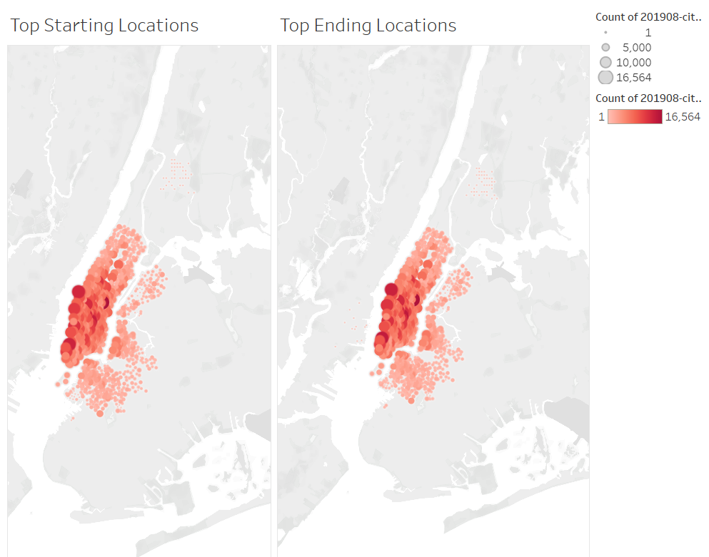
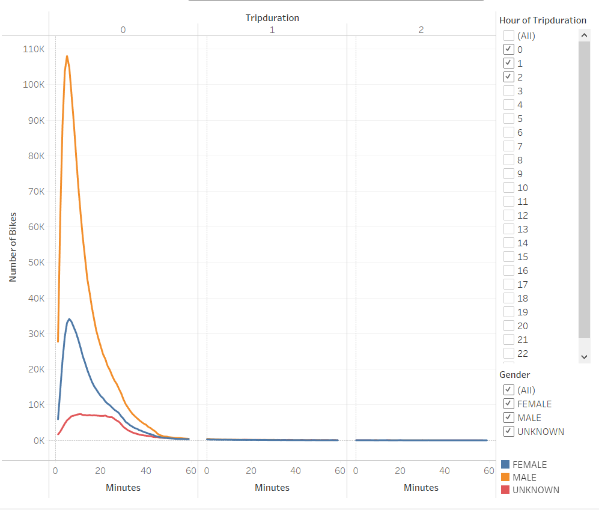
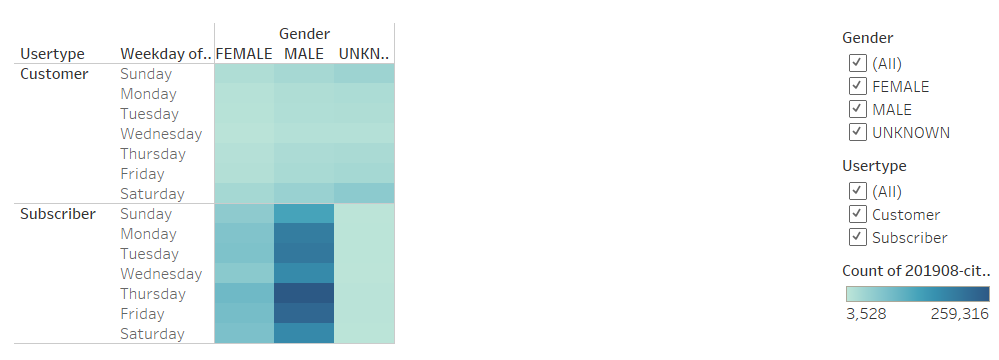
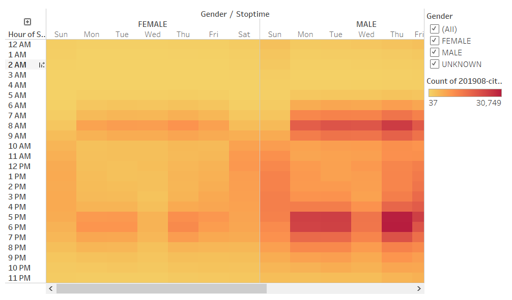
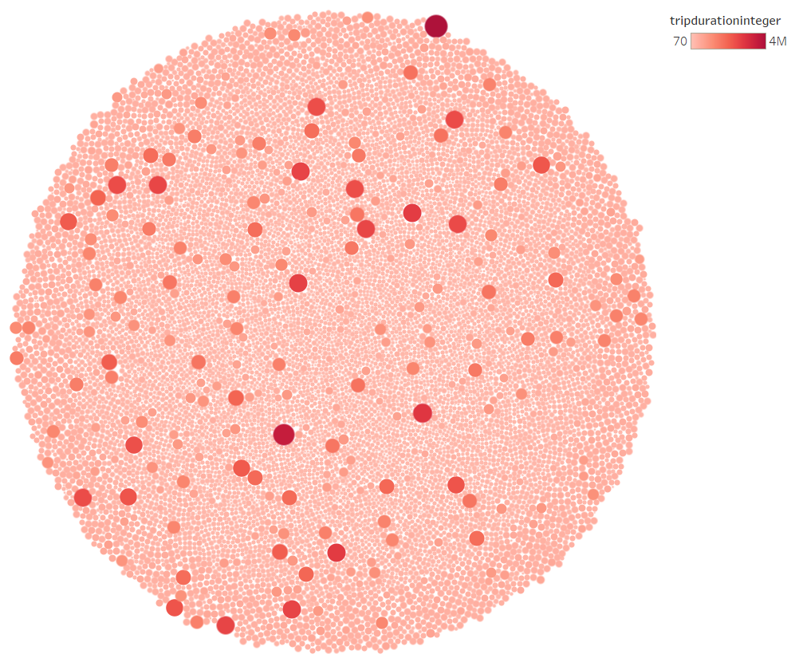

# Bikesharing_Tableau

## Overview
We are looking at biking data for the month of August in 2019. This data represents the users of the Citi Bikes in NYC which can be useful in determining the efficacy of the bikes and potentially draw conclusions to have the bikes more prevalent. To visualize this data, I used Tableau which will help us draw these conclusions by contextualizing the data.

## Tableau Workbook
[link to dashbaord](https://public.tableau.com/app/profile/jun.cho5678/viz/CitiBikeTrip_16747776371450/NYCBikeStory)

## Results
Here are some of the data.

This is a dashboard representing the starting locations of the Citi Bikes and the end locations.

This is a chart representing the trip durations based on gender. This charge shows the sum of trips that lasted for the given duration.

This shows which day of the week the bikes are used most frequently split by gender and split again by the user type, either customer or subscriber.

This chart shows what time the user stops using the bike broken up by what day of the week and gender.

This is a bubblechart showing which bikes have been used for a long duration, indicating which one would potentially need repair/maintenance. 

## Summary
From the charts, we can deduce the following:

**1. Males have a higher quantity of useage but the general distribution of start and end times seem to not matter based on gender.**

We can identify this by looking at the Gender to Stoptime chart and the Usertype and Weekday to Gender chart. Both of these show similar pattern of useage accross male and female. Yes it is clear that there is a much larger count for males, but the proportion of males and females remain consistent. In the future, I would recalculate the values to represent proportion of users on a particular day rather than a sum. This would help us compare the gender more if it was necessary for us to do so.

**2. People generally start and end at the same place.**

This is a little difficult to deduce and so the charts will need to be improved. However, it seems that the starting and end locations are consistent throughout when we compare the two heatmaps side by side. This is most likely because the people are heading to very specific tourist or work locations to get from one location to another - all starting and ending at similar areas. We know that this is the case for work locations because looking at the usertype data, we see that majority of users are actually subscribers, showing consistent useage of the bikes. This means that the users of the citibike generally start and end in similar highly dense areas. 
    
Additional visualizations for the future would be:

1. To remake the start and end locations separated by customer and subscriber. This would help us visualize which users are starting and ending in which areas. By separating this, we can market and tailer the experience to the type of user. If it is a location in which subscribers are more common, we can use this data to then market to users why they should subscribe. If it is a location in which customers are common, we can infer that these are tourists and can market to attract them toward using the bikes and to other locations.
2. To remake most charts using proportions and not sum. This will help us determine how the data is distributed for male and females more clearly to show that the proportions are consistent through gender. This would help us then understand that males and females can both make use of the bikes the same and we should focus our marketing on how we can bring more female users. 
